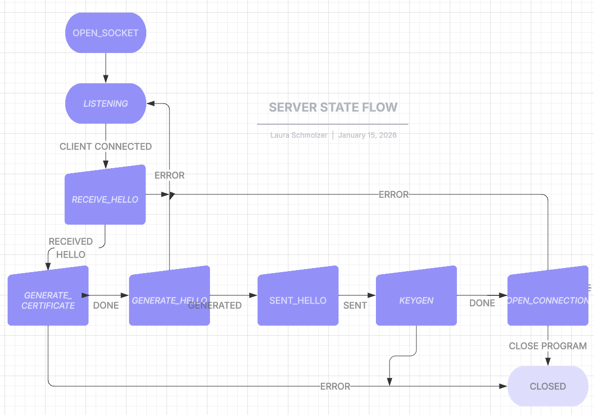

# TLS handshake implementation in Python
This project is a **simplifed TLS handshake** and is not intended to be a production-ready TLS implementation. It is a simulation used for educational purposes designed to demonstrate the cryptographic operations, key exchanges, and message flows involved in establishing a secure communication channel between a Client and Server.

## Objectives:
- Develop a Python-based TLS client and server that communicate over separate terminal.
- Implement a minimal, but cryptographically correct, TLS handshake.
- Provide detailed logging for educational and debugging purposes.
- Enable an interactive terminal that supports secure bidirectional messaging between client and server after the session establishment.
- Structure the handshake as a State Machine.

## State Machine Structure
### Client State Flow


### Server State Flow


## How to Run the Server and Client

1. Open **two separate terminal windows** (or tabs).

2. In the first terminal, start the server:

   ```bash
   python -m parties.server_driver
   ```
3. In the second terminal, start the client:
   ```bash
   python -m parties.client_driver
   ```
4. The client will connect to the server, perform the handshake, and then you can start sending messages interactively.

5. In order to close the server or client safely, use 
   ```bash
   exit
   ```

### Notes: 
- Make sure the Server is running before the Client as it is Client-initiated. 
- The connection uses HOST = "127.0.0.1" and PORT = 4444. Ensure no other process is using that port.
- Both scripts should be in the same directory, else adjust the paths.
- Pytest version 9.0.2 is used for testing.

## Cryptography Overview
- **Ephemeral key exchange:** X25519 used to derive a shared secret.
- **Symmetric encryption:** AES-GCM for authenticated encryption of messages.
- **PKI :** Server identity is verified via a CA-signed certificate.

## How to run testing:
```bash
   python -m pytest
```
